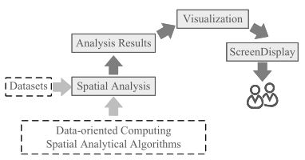

# Interactive Analysis of Large-Scale Spatial Vector Data via Visualization-oriented Computing (DEMO)
To address the scale issue for analysis of large-scale spatial vector data, we present a new spatial analysis computing model, visualization-oriented computing (VOC), for interactive analysis of large-scale spatial vector data. As show in Fig 1, VOC generates analysis results by directly determining the value of each pixel for display. Different from data-oriented computing (DOC) (see Fig 2) in traditional analysis methods, the computing units in VOC are pixels rather than spatial objects. As the number of pixels in the screen range is limited and stable, VOC has the advantage of being insensitive to data volumes.

*Fig1. Spatial analysis via visualization-oriented computing*

*Fig2.  Spatial analysis via data-oriented computing*

## Application Scenarios

***Tab1. Datasets of Scenario1: Roads, POI and Farmland of Mainland China (10-million-scale)***

| Name           | Type       | Records    | Size                 |
| -------------- | ---------- | ---------- | -------------------- |
| China_Road     | LineString | 21,898,508 | 163,171,928 segments |
| China_POI      | Point      | 20,258,450 | 20,258,450 points    |
| China_Farmland | Polygon    | 10,520,644 | 133,830,561 edges    |

***Tab2. Datasets of Scenario 2&3:  Spain [OpenStreetMap](https://download.geofabrik.de/europe/spain-latest.osm.pbf)*** ([Classification standard](https://wiki.openstreetmap.org/wiki/Map_Features))

| Name                                  | Type       | Records   | Size                |
| ------------------------------------- | ---------- | --------- | ------------------- |
| Amenity_Education                     | Point      | 6,994     | 6,994 Points        |
| Amenity_Entertainment, Arts & Culture | Point      | 6,928     | 6,928 Points        |
| Amenity_Financial                     | Point      | 13,040    | 13,040 Points       |
| Amenity_Healthcare                    | Point      | 14,757    | 14,757 Points       |
| Amenity_Sustenance                    | Point      | 89,282    | 89,282 Points       |
| Amenity_Transportation                | Point      | 3,114     | 3,114 Points        |
| Shop                                  | Point      | 82,192    | 82,192 Points       |
| Religion                              | Point      | 6,219     | 6,219 Points        |
| Historic                              | Point      | 14,974    | 14,974 Points       |
| Leisure                               | Point      | 8,334     | 8,334 Points        |
| Tourism                               | Point      | 36,462    | 36,462 Points       |
| Places                                | Point      | 582,464   | 582,464 Points      |
| Public_Transport                      | Point      | 45,478    | 45,478 Points       |
| Railway                               | Linestring | 97,675    | 309,716 Segments    |
| Highway                               | Linestring | 3,132,496 | 42,497,196 Segments |
| Waterway                              | Linestring | 33,214    | 4,254,732 Segments  |
| Natural_Beach                         | Point      | 148       | 148 Points          |
| Natural_Cave                          | Point      | 3,237     | 3,237 Points        |
| Natural_Cliff                         | Point      | 155       | 155 Points          |
| Natural_Peak                          | Point      | 28,106    | 28,106 Points       |
| Natural_Spring                        | Point      | 4,780     | 4,780 Points        |
| Natural_Tree                          | Point      | 533,856   | 533,856 Points      |
| Natural_Volcano                       | Point      | 13        | 13 Points           |
| Water_Area                            | Polygon    | 60,319    | 2,044,622 Edges     |
| Pois_Area                             | Polygon    | 279,010   | 2,462,611 Edges     |
| Pofw_Area                             | Polygon    | 23,337    | 265,523 Edges       |
| Natural_Area                          | Polygon    | 4,034     | 114184 Edges        |
| Places_Area                           | Polygon    | 4,133     | 273,679 Edges       |
| Landuse_Area                          | Polygon    | 459,946   | 18,528,176 Edges    |
| Buildings_Area                        | Polygon    | 2,039,096 | 14,829,921 Edges    |

***Tab3.  Demo Environment***

| Item             | Description                                      |
| ---------------- | ------------------------------------------------ |
| CPU              | 4core*2, Intel(R) Xeon(R) CPU E5-2680 v3@2.50GHz |
| Memory           | 32 GB                                            |
| Operating System | Centos7                                          |

## Contact:

Mengyu Ma@ National University of Defense Technology

Email: mamengyu10@nudt.edu.cn

Tel:+8615507487344